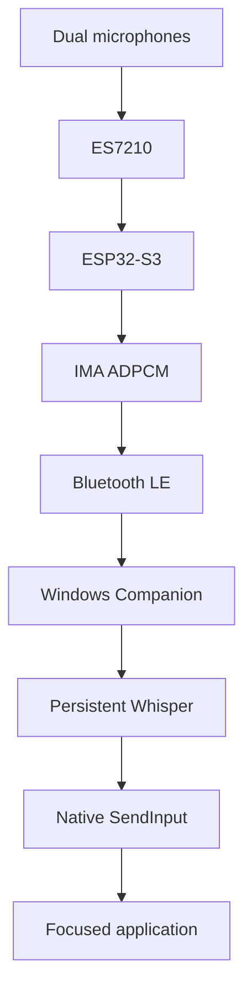
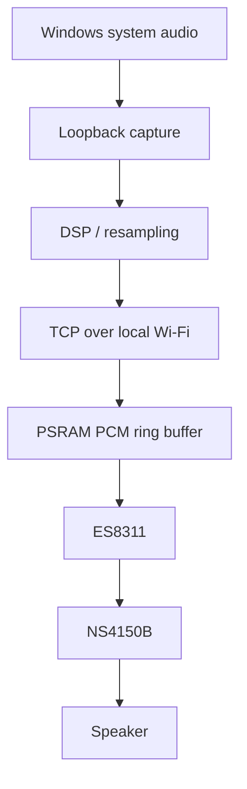
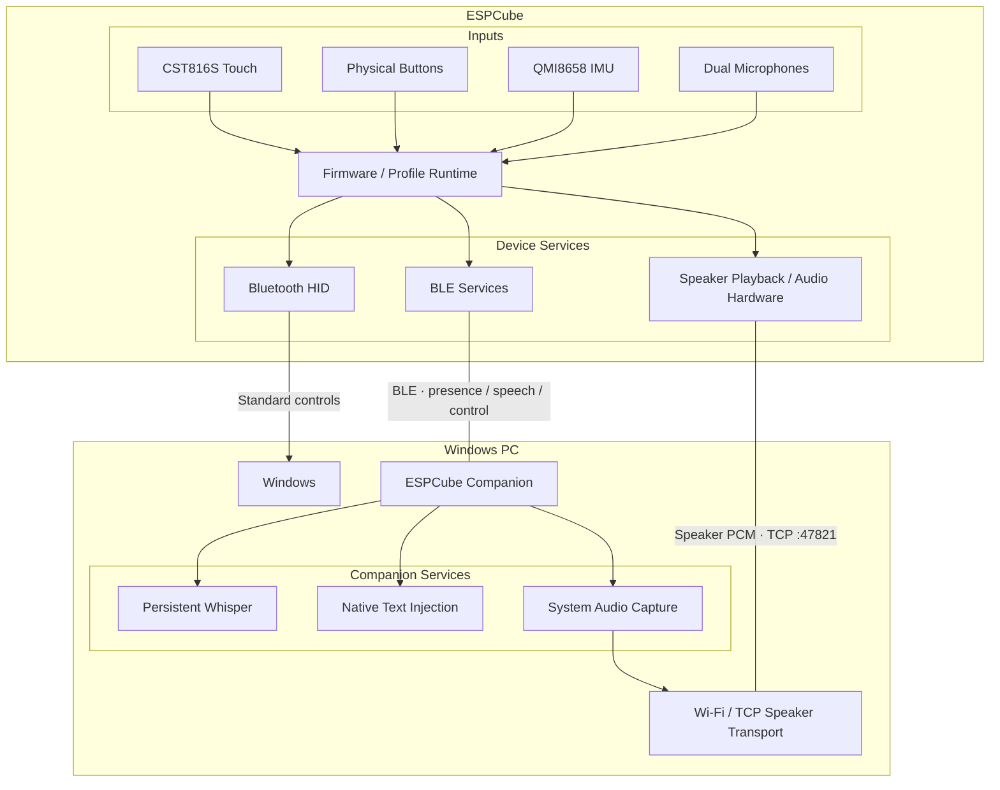
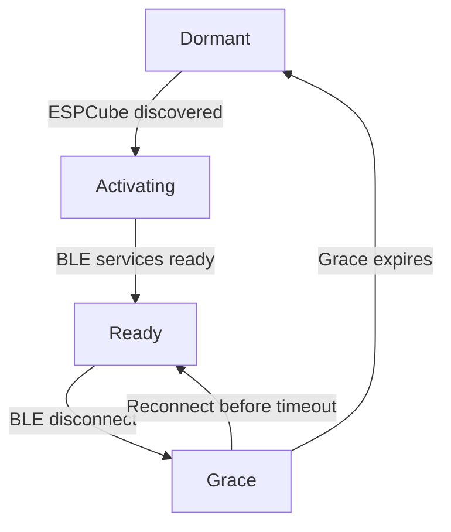
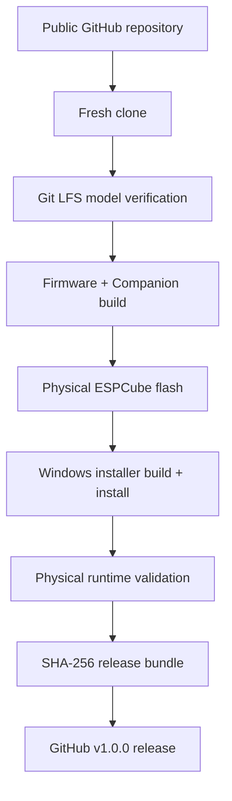

<div align="center">

# ESPCube

### A universal handheld interface built on the ESP32-S3

**Motion control · Touch · Local speech · Windows audio · One compact device**

[](https://github.com/hasan-bukhari-dev/ESPCube/releases/latest)


[**Download v1.0.0**](https://github.com/hasan-bukhari-dev/ESPCube/releases/tag/v1.0.0)
&nbsp;•&nbsp;
[**Quick Start**](docs/QUICK_START.md)
&nbsp;•&nbsp;
[**Architecture**](docs/ARCHITECTURE.md)
&nbsp;•&nbsp;
[**Hardware**](docs/HARDWARE.md)
&nbsp;•&nbsp;
[**Troubleshooting**](docs/TROUBLESHOOTING.md)

</div>

---

## What is ESPCube?

**ESPCube is a profile-driven handheld computer interface built around the Waveshare ESP32-S3-Touch-LCD-1.54.**

It combines a 240×240 capacitive touchscreen, a 6-axis IMU, physical buttons, dual microphones, onboard audio, Bluetooth LE, Wi-Fi, 8 MB PSRAM, and 16 MB flash into a small device that can become different kinds of interfaces without being locked to one game, one app, or one workflow.

The v1.0.0 baseline includes:

| Profile | What it does | Transport | Companion? |
|---|---|---|---:|
| **Mouse** | Gyro pointer + physical click controls | Bluetooth HID | No |
| **Text** | Touch interaction + local speech-to-text | BLE + native Windows input | For speech |
| **Speaker** | Mirrors Windows system audio to ESPCube | BLE control + Wi-Fi/TCP audio | Yes |
| **Settings** | Device and Companion configuration | Local / BLE as applicable | No for device settings |

> [!IMPORTANT]
> **Hold A + C together to return HOME.**  
> The HOME gesture is intentionally independent of profile-specific behavior.

The core product rule is simple: **standard Bluetooth HID handles ordinary controls whenever possible; the Companion extends ESPCube instead of becoming a prerequisite for everything.**

---

# Why this project is more than a controller

The launcher is intentionally simple. Underneath it, ESPCube v1.0.0 spans embedded firmware, desktop software, custom BLE services, local inference, native Windows integration, real-time audio, Wi-Fi provisioning, TCP streaming, PSRAM buffering, and release tooling.

### Engineering highlights

| Area | v1.0.0 implementation |
|---|---|
| Motion | QMI8658 6-axis IMU + gyro pointer mapping |
| Touch | CST816S capacitive touchscreen |
| Host control | Standard Bluetooth HID |
| BLE | NimBLE discovery/presence + custom GATT services |
| Speech capture | ES7210 microphone frontend |
| Speech transport | IMA ADPCM over BLE |
| Speech integrity | sequence tracking + frame/sample parity validation |
| Speech ordering | pre-START staging + deferred END drain |
| Inference | persistent local Whisper context |
| Text output | native Windows `SendInput` Unicode injection |
| PC audio capture | Windows system loopback |
| Speaker transport | TCP over temporary local Wi-Fi |
| Stream format | 32 kHz mono signed PCM16 little-endian |
| Buffering | PSRAM-backed PCM ring buffer |
| Audio output | ESP32-S3 → ES8311 → NS4150B |
| Desktop app | native Rust + eframe/egui |
| BLE lifecycle | Dormant → Activating → Ready → Grace |
| Reconnect behavior | configurable grace period keeps runtime warm |
| Wi-Fi trust | per-user trusted network state |
| Distribution | per-user Windows installer |
| Model delivery | Git LFS + installer-bundled Whisper model |
| Release proof | fresh clone → build → flash → install → physical runtime test |

The point is not complexity for its own sake. Each subsystem exists because a particular profile needs it.

---

# Features

## Mouse

The Mouse profile turns ESPCube into a compact motion controller.

- gyro-driven pointer movement
- physical click controls
- touchscreen profile interaction
- direct standard Bluetooth HID
- no Companion required for ordinary mouse use

```text
ESPCube ── Bluetooth HID ──► Windows
```

---

## Text + local speech

The Text profile combines touchscreen interaction with local voice transcription.



The production speech path includes:

- IMA ADPCM transport over BLE
- sequence-gap tracking
- frame/sample parity checks
- invalid-packet accounting
- pre-START audio staging
- deferred END handling for BLE notification ordering
- a persistent Whisper context
- native Unicode text insertion into the focused Windows application

The Companion does **not** spawn `whisper-cli.exe` for each utterance, and normal users do **not** need Python.

The installer bundles:

```text
ggml-tiny.en.bin
```

---

## Speaker

Speaker turns ESPCube into a local Windows audio endpoint.



### Speaker design

- BLE remains the **control and presence plane**
- Wi-Fi is activated only for Speaker audio
- TCP port: **47821**
- output: **32 kHz mono PCM16**
- Companion writes **320-sample / 640-byte** chunks
- TCP uses `TCP_NODELAY`
- the device-side ring buffer lives in PSRAM
- the ring buffer tracks occupancy and high-water usage
- a Windows audio-device change can rebuild loopback capture and DSP
- a TCP failure can trigger reconnect/re-provision logic while the profile remains ready

This separation keeps normal ESPCube operation Bluetooth-first while giving continuous audio a transport better suited to the workload.

---

## Settings

The native Companion exposes practical lifecycle controls:

- **Show when ESPCube connects**
- **Start quietly with Windows (optional; off by default)**
- **Speech typing**
- **Windows Speaker mirror**
- configurable disconnect grace period

Device-side Settings cover hardware/profile behavior such as motion configuration and calibration.

---

# System architecture

ESPCube is both an embedded device and a native desktop application.



The architecture intentionally separates:

- **direct host control** through standard HID
- **Companion services** through BLE
- **high-bandwidth Speaker audio** through local Wi-Fi/TCP

For the deeper engineering view, see [`docs/ARCHITECTURE.md`](docs/ARCHITECTURE.md).

---

# Companion lifecycle

The desktop runtime models ESPCube presence explicitly:



Why Grace exists:

- short BLE disconnects should not immediately unload Whisper
- reconnect scanning can continue
- heavy runtime state stays warm
- a brief interruption does not force a cold restart

The default disconnect grace is three minutes.

---

# Hardware

ESPCube v1 targets the **Waveshare ESP32-S3-Touch-LCD-1.54**.

| Component | Specification |
|---|---|
| MCU | ESP32-S3R8 |
| CPU | Dual-core Xtensa LX7 |
| PSRAM | 8 MB |
| Flash | 16 MB |
| Display | 1.54" 240×240 ST7789 |
| Touch | CST816S capacitive touch |
| IMU | QMI8658 6-axis |
| Microphone frontend | ES7210 |
| Audio codec | ES8311 |
| Amplifier | NS4150B |
| Wireless | 2.4 GHz Wi-Fi + Bluetooth LE |
| Firmware | Arduino framework via PlatformIO |
| Companion | Native Rust / Windows |

<details>
<summary><strong>Developer pinout</strong></summary>

<br>

| Function | GPIO |
|---|---:|
| I²C SDA | 42 |
| I²C SCL | 41 |
| Touch RST | 47 |
| Touch INT | 48 |
| LCD CS | 21 |
| LCD CLK | 38 |
| LCD MOSI | 39 |
| LCD RST | 40 |
| LCD DC | 45 |
| LCD backlight | 46 |
| Audio MCLK | 8 |
| Audio BCLK | 9 |
| Audio WS | 10 |
| Audio DIN | 11 |
| Audio DOUT | 12 |
| PA control | 7 |

The shared I²C bus is initialized by firmware with:

```cpp
Wire.begin(42, 41);
```

</details>

Full hardware notes: [`docs/HARDWARE.md`](docs/HARDWARE.md)

---

# How ESPCube connects

Three transports, three different jobs:

| Path | Purpose |
|---|---|
| **Bluetooth HID** | direct standard host control |
| **Bluetooth LE** | Companion presence, speech, Speaker control, provisioning |
| **Wi-Fi + TCP** | Speaker PCM only |

```text
Standard controls:
ESPCube ── Bluetooth HID ──► Windows

Extended services:
ESPCube ◄──── BLE ────► Companion

Speaker data:
Companion ── local Wi-Fi / TCP ──► ESPCube
```

Personal Wi-Fi credentials are **not compiled into the public firmware**.

The Companion stores trusted Wi-Fi state locally at:

```text
%LOCALAPPDATA%\ESPCube\trusted_wifi.json
```

Companion settings live at:

```text
%LOCALAPPDATA%\ESPCube\companion.json
```

---

# Install ESPCube

## 1. Flash the firmware

Connect the Waveshare board using a USB **data** cable.

From `firmware/`:

```powershell
platformio run -e espcube -t upload
```

If you need an explicit serial port:

```powershell
platformio run -e espcube -t upload --upload-port COM22
```

Find Windows serial ports:

```powershell
Get-CimInstance Win32_SerialPort |
    Select-Object DeviceID, Name
```

A Windows helper is included:

```powershell
.\scripts\flash-windows.ps1 -Port COM22
```

---

## 2. Install the Windows Companion

Download:

**[`ESPCube-Companion-v1.0.0-Setup.exe`](https://github.com/hasan-bukhari-dev/ESPCube/releases/download/v1.0.0/ESPCube-Companion-v1.0.0-Setup.exe)**

The installer:

- installs per-user
- bundles the Whisper model
- creates a Start Menu shortcut
- leaves Windows background startup opt-in through the Companion setting
- includes uninstall support
- does not require Python

Install location:

```text
%LOCALAPPDATA%\Programs\ESPCube Companion
```

---

## 3. Pair ESPCube

If Windows has not paired it yet:

```text
Settings
→ Bluetooth & devices
→ Add device
→ Bluetooth
→ ESPCube
```

---

## 4. Recommended Companion settings

```text
Show when ESPCube connects      ON
Start quietly with Windows      OFF (enable only if wanted)
Speech typing                   ON
Windows Speaker mirror          ON
```

---

# Daily use

After setup, the normal routine is intentionally short:

1. Log into Windows.
2. Turn on ESPCube.
3. Wait for Bluetooth.
4. The Companion detects the device.
5. With **Show when ESPCube connects** enabled, the window appears.
6. Choose **Mouse**, **Text**, **Speaker**, or **Settings**.
7. Hold **A + C** whenever you want HOME.

No PowerShell, manual Whisper launch, or development harness should be needed for normal use.

---

# Companion background behavior

Background watching is optional. By default, the Companion behaves like a normal app and only runs when you open it.

- **Start quietly with Windows (optional)** launches it hidden at login and keeps the BLE watcher resident.
- **Show when ESPCube connects** can surface and focus the existing background window on a new Ready connection.
- **Minimize** keeps it on the taskbar.
- With Windows startup **off**, **X** exits the Companion.
- With Windows startup **on**, **X** hides the window while the background watcher continues.
- **Quit** always terminates the process.

### Reopen manually

Start Menu:

```text
ESPCube Companion
```

PowerShell:

```powershell
Start-Process "$env:LOCALAPPDATA\Programs\ESPCube Companion\ESPCube Companion.exe"
```

If a hidden instance does not surface:

```powershell
Get-Process "ESPCube Companion" -ErrorAction SilentlyContinue |
    Stop-Process -Force

Start-Process "$env:LOCALAPPDATA\Programs\ESPCube Companion\ESPCube Companion.exe"
```

More details: [`docs/COMPANION.md`](docs/COMPANION.md)

---

# Privacy and local processing

### Speech

- Whisper inference runs locally on the Windows PC.
- The production path does not require cloud transcription.
- Release users do not need Python or an external Whisper CLI.

### Wi-Fi

- personal Wi-Fi credentials are not hardcoded into public firmware
- trusted networks are stored locally by the Companion for the current Windows user
- Speaker is the only v1 profile that requires Wi-Fi

---

# Build from source

Because the Whisper model is tracked with Git LFS:

```powershell
git lfs install
git clone https://github.com/hasan-bukhari-dev/ESPCube.git
cd ESPCube
git lfs ls-files
```

## Firmware

```powershell
cd firmware
platformio run -e espcube
platformio run -e espcube -t upload --upload-port COM22
```

## Companion

```powershell
cd companion
cargo check
cargo test
cargo build --release
```

Build the installer:

```powershell
.\scripts\build-installer-windows.ps1
```

Complete guide: [`docs/BUILDING.md`](docs/BUILDING.md)

---

# Release validation

ESPCube v1.0.0 was validated from the **public repository**, not from an old local development workspace.



Shipping workflows tested:

- Mouse
- Text
- speech via Companion
- Speaker
- Settings
- A + C HOME
- Speaker disconnect/reconnect
- installed Companion startup

See [`docs/RELEASE_VALIDATION.md`](docs/RELEASE_VALIDATION.md).

---

# Release integrity

The v1.0.0 release includes:

```text
ESPCube-Companion-v1.0.0-Setup.exe
firmware.bin
firmware.factory.bin
bootloader.bin
partitions.bin
SHA256SUMS.txt
```

Verify the installer:

```powershell
Get-FileHash .\ESPCube-Companion-v1.0.0-Setup.exe -Algorithm SHA256
```

Expected v1.0.0 installer SHA-256:

```text
0C94DF4423500F12F5868C3DFD81C09DC9393D8FEA226C069D24B1496D1B4037
```

Use the published [`SHA256SUMS.txt`](https://github.com/hasan-bukhari-dev/ESPCube/releases/download/v1.0.0/SHA256SUMS.txt) for the remaining artifacts.

---

# Repository map

```text
ESPCube/
│
├── firmware/
│   ├── src/                         launcher / profile coordination
│   ├── lib/                         HID, speech, Speaker services
│   ├── include/                     configuration / blank secrets stub
│   ├── scripts/                     flash helper
│   └── platformio.ini
│
├── companion/
│   ├── src/                         native Rust Companion
│   ├── models/                      Whisper model via Git LFS
│   ├── installer/                   Windows installer definition
│   └── scripts/                     build tooling
│
├── docs/
│   ├── ADDING_A_PROFILE.md
│   ├── ARCHITECTURE.md
│   ├── BUILDING.md
│   ├── COMPANION.md
│   ├── DESIGN_PRINCIPLES.md
│   ├── HARDWARE.md
│   ├── PROTOCOL.md
│   ├── QUICK_START.md
│   ├── RELEASE_VALIDATION.md
│   └── TROUBLESHOOTING.md
│
├── releases/
│   └── SHA256SUMS.txt
│
└── README.md
```

---

# Extending ESPCube

A profile is a capability layer over shared hardware and services.

```text
Launcher
   │
   ▼
Profile
   ├── touch
   ├── buttons
   ├── IMU
   ├── HID
   ├── optional BLE service
   ├── optional audio
   └── optional Companion capability
```

New profiles should preserve:

- HOME recovery
- direct HID where possible
- safe teardown of held state
- temporary-resource cleanup
- Wi-Fi-off-by-default unless bandwidth justifies it

See [`docs/ADDING_A_PROFILE.md`](docs/ADDING_A_PROFILE.md).

---

# Troubleshooting

| Symptom | First place to look |
|---|---|
| ESPCube not found | Bluetooth / BLE |
| Mouse works, speech does not | Companion speech status |
| Speech transcribes but does not type | Windows input focus |
| Speaker opens but no sound | trusted Wi-Fi + audio output |
| Audio device changes mid-stream | Companion recovery / reopen Speaker |
| Companion is hidden | reopen or restart Companion |
| Firmware will not flash | USB data cable + COM port |

Full guide: [`docs/TROUBLESHOOTING.md`](docs/TROUBLESHOOTING.md)

---

# Documentation

| Document | Purpose |
|---|---|
| [`QUICK_START.md`](docs/QUICK_START.md) | Setup and first demo |
| [`ARCHITECTURE.md`](docs/ARCHITECTURE.md) | Full embedded + desktop architecture |
| [`HARDWARE.md`](docs/HARDWARE.md) | Board, buses, pinout and audio paths |
| [`COMPANION.md`](docs/COMPANION.md) | Native Windows Companion design |
| [`PROTOCOL.md`](docs/PROTOCOL.md) | BLE speech + Speaker control/TCP protocol |
| [`BUILDING.md`](docs/BUILDING.md) | Reproducible source builds |
| [`ADDING_A_PROFILE.md`](docs/ADDING_A_PROFILE.md) | Profile extension contract |
| [`TROUBLESHOOTING.md`](docs/TROUBLESHOOTING.md) | Symptom-first recovery |
| [`DESIGN_PRINCIPLES.md`](docs/DESIGN_PRINCIPLES.md) | Product rules future changes should preserve |
| [`RELEASE_VALIDATION.md`](docs/RELEASE_VALIDATION.md) | v1 validation record + future release checklist |

---

# Technology

ESPCube builds on:

- Espressif ESP32-S3
- Waveshare ESP32-S3-Touch-LCD-1.54
- PlatformIO
- Arduino
- NimBLE-Arduino
- Arduino_GFX
- ArduinoJson
- Rust
- eframe / egui
- btleplug
- whisper-rs / Whisper ecosystem

Third-party components remain subject to their respective terms.

---

<div align="center">

## ESPCube v1.0.0

**One handheld. Multiple interfaces. A platform designed to grow.**

[**Download**](https://github.com/hasan-bukhari-dev/ESPCube/releases/tag/v1.0.0)
&nbsp;•&nbsp;
[**Quick Start**](docs/QUICK_START.md)
&nbsp;•&nbsp;
[**Architecture**](docs/ARCHITECTURE.md)
&nbsp;•&nbsp;
[**Source**](https://github.com/hasan-bukhari-dev/ESPCube)

</div>
