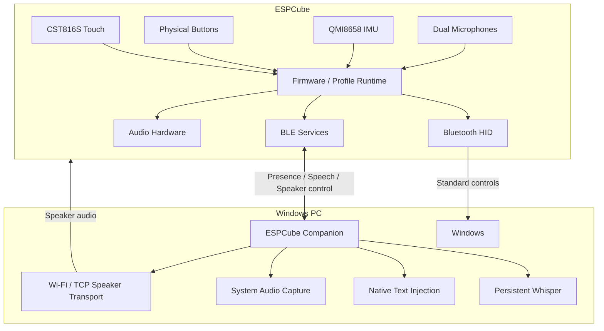

<div align="center">

# ESPCube

### A universal handheld interface built on the ESP32-S3.

**Motion control · Touch · Local speech · Windows audio · One compact device**

[](https://github.com/hasan-bukhari-dev/ESPCube/releases/latest)


[**Download v1.0.0**](https://github.com/hasan-bukhari-dev/ESPCube/releases/tag/v1.0.0)
&nbsp;•&nbsp;
[**Quick Start**](docs/QUICK_START.md)
&nbsp;•&nbsp;
[**Architecture**](docs/ARCHITECTURE.md)
&nbsp;•&nbsp;
[**Hardware**](docs/HARDWARE.md)
&nbsp;•&nbsp;
[**Troubleshooting**](docs/TROUBLESHOOTING.md)

</div>

---

## ESPCube in one minute

**ESPCube is a profile-driven handheld computer interface built around the Waveshare ESP32-S3-Touch-LCD-1.54.**

It combines a 240×240 capacitive touchscreen, a 6-axis IMU, physical buttons, dual microphones, onboard audio hardware, Bluetooth LE, Wi-Fi, 8 MB PSRAM, and 16 MB flash into a small device that can behave as more than one kind of controller.

The v1.0.0 baseline includes:

| Profile | What it does | Main transport | Companion needed? |
|---|---|---|---:|
| **Mouse** | Gyro pointer + physical click controls | Bluetooth HID | No |
| **Text** | Touch interaction + local speech-to-text | BLE + native Windows input | For speech |
| **Speaker** | Mirrors Windows system audio to ESPCube | BLE control + Wi-Fi/TCP audio | Yes |
| **Settings** | Device and Companion configuration | Local / BLE as applicable | No for device settings |

The product rule is deliberate: **standard Bluetooth HID handles ordinary controls whenever possible; the Companion extends the device instead of becoming a prerequisite for everything.**

> [!IMPORTANT]
> **Hold A + C together to return HOME.**  
> The hard HOME gesture is intentionally independent of profile-specific behavior.

---

# Why ESPCube exists

ESPCube is not meant to be one game controller, one remote, or one desktop macro pad.

The goal is a **universal handheld interface** whose behavior changes through profiles while the core device remains useful and recoverable.

That leads to a few design choices that shape the whole project:

- basic interaction should use **standard HID** before custom host software
- profiles may add richer services without replacing the universal baseline
- **A + C HOME** remains available as a physical escape path
- high-bandwidth transports are enabled only when a profile actually needs them
- local processing is preferred where practical
- public source is treated as the release source of truth
- new capabilities should preserve already-proven device behavior

See [`docs/DESIGN_PRINCIPLES.md`](docs/DESIGN_PRINCIPLES.md) for the full design contract.

---

# What ESPCube actually implements

The launcher is intentionally simple. Under it, v1.0.0 spans embedded firmware, Bluetooth HID, custom BLE services, compressed speech transport, local inference, native Windows integration, loopback audio capture, Wi-Fi provisioning, TCP streaming, device-side buffering, and release tooling.

| Area | v1.0.0 implementation |
|---|---|
| Motion input | QMI8658 6-axis IMU + gyro pointer mapping |
| Touch | CST816S capacitive touchscreen |
| Host control | Standard Bluetooth HID |
| BLE | NimBLE-based discovery/presence + custom GATT services |
| Speech capture | ES7210 microphone frontend |
| Speech transport | IMA ADPCM over BLE |
| Speech integrity | sequence tracking, frame/sample parity checks, invalid-packet accounting |
| Speech ordering | pre-START staging + deferred END drain for notification ordering |
| Speech inference | persistent local Whisper runtime |
| Text output | native Windows `SendInput` Unicode injection |
| PC audio capture | Windows system loopback capture |
| Speaker transport | TCP over temporary local Wi-Fi |
| Audio stream | 32 kHz mono signed PCM16 little-endian |
| Device buffering | PSRAM-backed PCM ring buffer |
| Speaker output | ESP32-S3 → ES8311 → NS4150B |
| Desktop app | native Rust + eframe/egui |
| BLE lifecycle | Dormant → Activating → Ready → Grace |
| Reconnect behavior | configurable grace period keeps heavy runtime warm |
| Wi-Fi trust | per-user trusted-network state managed by Companion |
| Desktop lifecycle | background startup + single-instance coordination |
| Distribution | per-user Windows installer |
| Model delivery | Git LFS + installer-bundled Whisper model |
| Release proof | fresh clone → build → flash → install → physical runtime test |

No hype is needed here; these are simply the systems that exist in the v1 path.

---

# Features

## Mouse

The Mouse profile turns ESPCube into a compact motion controller.

- QMI8658 IMU drives gyro-based pointer movement
- physical buttons provide click controls
- touchscreen participates in profile interaction
- host control uses standard Bluetooth HID
- ordinary mouse operation does **not** require the Windows Companion

This keeps the basic path direct:

```text
ESPCube
   │
   └── Bluetooth HID ───────────────► Windows
```

---

## Text + local speech

The Text profile combines touchscreen interaction with local speech-to-text.

The production speech path is:

```text
Dual microphones
      │
      ▼
    ES7210
      │
      ▼
  ESP32-S3
      │
      ├── IMA ADPCM encoding
      ├── sequence numbering
      └── frame/sample accounting
      │
      ▼
 Bluetooth LE
      │
      ▼
Windows Companion
      │
      ├── packet validation
      ├── sequence-gap accounting
      ├── pre-START audio staging
      ├── deferred END drain
      └── IMA ADPCM decode
      │
      ▼
Persistent local Whisper
      │
      ▼
Native Windows SendInput
      │
      ▼
Focused application
```

### What that means in practice

- speech recognition runs **locally on the Windows PC**
- the production path does **not** require Python
- the production path does **not** spawn `whisper-cli.exe` per utterance
- the installer bundles `ggml-tiny.en.bin`
- the Companion keeps the Whisper context loaded while ESPCube is active
- transport validation checks frame/sample counts and notification failures before transcription
- recognized text is inserted into the currently focused Windows application through native Unicode input events

The Companion uses an 800 ms deferred-END window to tolerate a Windows BLE ordering case where the `END` control notification can arrive before the final audio notification.

---

## Speaker

Speaker turns ESPCube into a local Windows audio endpoint.

The data plane is intentionally different from the control plane:

```text
Windows system output
      │
      ▼
System loopback capture
      │
      ▼
Companion DSP / resampling
      │
      ├── 32 kHz target rate
      └── 320-sample PCM chunks
      │
      ▼
TCP over local Wi-Fi
      │
      ▼
ESPCube
      │
      ▼
PSRAM-backed PCM ring buffer
      │
      ▼
ES8311 codec
      │
      ▼
NS4150B amplifier
      │
      ▼
Speaker
```

### Speaker transport

- BLE remains responsible for **presence, readiness, and control**
- Wi-Fi is used for the high-bandwidth audio stream
- TCP port: **47821**
- audio format: **32 kHz, mono, signed PCM16 little-endian**
- Companion chunks output into **320-sample / 640-byte** writes
- TCP uses `TCP_NODELAY`
- the device-side ring buffer allocates from **PSRAM**
- the ring buffer tracks current occupancy and a high-water mark
- a TCP failure can trigger re-provision/reconnect logic while the profile remains ready
- a Windows endpoint change can restart loopback capture and rebuild the DSP path

> [!NOTE]
> ESPCube does **not** need Wi-Fi for normal Bluetooth HID use.  
> Wi-Fi exists in v1 because Speaker audio needs a data path that is better suited to continuous PCM than the BLE control channel.

---

## Settings

The native Companion exposes practical lifecycle controls:

- **Show when ESPCube connects**
- **Start quietly with Windows**
- **Speech typing**
- **Windows Speaker mirror**
- **Sleep after disconnect** / configurable grace period

The default disconnect grace period is three minutes. During Grace, the Companion continues trying to reconnect while keeping heavy runtime state available instead of immediately tearing it down.

Device-side settings provide the control surface for hardware/profile behavior such as motion configuration and calibration.

---

# Two halves of one product

ESPCube is both embedded firmware **and** a native desktop companion.

```text
┌──────────────────────────┐            ┌──────────────────────────────┐
│         ESPCube          │            │      Windows Companion       │
│                          │            │                              │
│  Touchscreen             │            │  BLE lifecycle manager       │
│  Physical buttons        │◄── BLE ───►│  Persistent Whisper          │
│  QMI8658 IMU             │            │  Speech decoder/validator    │
│  Dual microphones        │            │  Native text injection       │
│  Audio codec + amplifier │            │  System loopback capture     │
│                          │            │  DSP + TCP Speaker transport │
│  Bluetooth HID ──────────┼───────────►│  Windows host                │
│                          │            │  Trusted Wi-Fi state         │
│  PCM ring buffer ◄───────┼── TCP ─────│  Audio server path           │
└──────────────────────────┘            └──────────────────────────────┘
```

The Companion is an extension layer. Direct HID remains direct.

---

# System architecture

This is the high-level runtime view.



The architecture intentionally separates **direct host control** from **extended Companion services**.

For the full engineering view, including lifecycle, speech ordering, audio buffering and failure recovery, see [`docs/ARCHITECTURE.md`](docs/ARCHITECTURE.md).

---

# Hardware

ESPCube v1 targets the **Waveshare ESP32-S3-Touch-LCD-1.54**.

| Component | Specification |
|---|---|
| MCU | ESP32-S3R8 |
| CPU | Dual-core Xtensa LX7 |
| PSRAM | 8 MB |
| Flash | 16 MB |
| Display | 1.54" 240×240 ST7789 |
| Touch | CST816S capacitive touch |
| IMU | QMI8658 6-axis |
| Microphone frontend | ES7210 |
| Audio codec | ES8311 |
| Amplifier | NS4150B |
| Wireless | 2.4 GHz Wi-Fi + Bluetooth LE |
| Firmware framework | Arduino |
| Build system | PlatformIO |
| Companion | Native Rust / Windows |

<details>
<summary><strong>Developer pinout</strong></summary>

<br>

| Function | GPIO |
|---|---:|
| I²C SDA | 42 |
| I²C SCL | 41 |
| Touch RST | 47 |
| Touch INT | 48 |
| LCD CS | 21 |
| LCD CLK | 38 |
| LCD MOSI | 39 |
| LCD RST | 40 |
| LCD DC | 45 |
| LCD backlight | 46 |
| Audio MCLK | 8 |
| Audio BCLK | 9 |
| Audio WS | 10 |
| Audio DIN | 11 |
| Audio DOUT | 12 |
| Power amplifier control | 7 |

The shared I²C bus is initialized by the firmware with:

```cpp
Wire.begin(42, 41);
```

</details>

Full hardware notes: [`docs/HARDWARE.md`](docs/HARDWARE.md)

---

# Install ESPCube

## For normal users

### 1. Flash the firmware

Connect the Waveshare board over a USB **data** cable.

From `firmware/`:

```powershell
platformio run -e espcube -t upload
```

If you need to select the serial port explicitly:

```powershell
platformio run -e espcube -t upload --upload-port COM22
```

`COM22` is only an example.

To list serial ports on Windows:

```powershell
Get-CimInstance Win32_SerialPort |
    Select-Object DeviceID, Name
```

A Windows helper is included:

```powershell
.\scripts\flash-windows.ps1 -Port COM22
```

---

### 2. Install the Windows Companion

Download:

**[`ESPCube-Companion-v1.0.0-Setup.exe`](https://github.com/hasan-bukhari-dev/ESPCube/releases/download/v1.0.0/ESPCube-Companion-v1.0.0-Setup.exe)**

The installer:

- installs per-user
- bundles the v1 Whisper model
- creates a Start Menu shortcut
- registers background Windows startup
- includes uninstall support
- does not require Python for normal use

Install location:

```text
%LOCALAPPDATA%\Programs\ESPCube Companion
```

---

### 3. Pair ESPCube

If Windows has not paired the device yet:

```text
Settings
→ Bluetooth & devices
→ Add device
→ Bluetooth
→ ESPCube
```

---

### 4. Recommended Companion settings

For the intended daily workflow:

```text
Show when ESPCube connects      ON
Start quietly with Windows      ON
Speech typing                   ON
Windows Speaker mirror          ON
```

---

# Daily use

After installation, the normal routine is short:

1. Log into Windows.
2. Turn on ESPCube.
3. Wait for Bluetooth.
4. The Companion detects the Cube.
5. If **Show when ESPCube connects** is enabled, its window appears.
6. Choose **Mouse**, **Text**, **Speaker**, or **Settings** on the Cube.
7. Hold **A + C** at any point to return HOME.

There should be no need to open PowerShell, reload Whisper, or manually start a development harness.

---

# Companion background behavior

The Companion is designed to remain available quietly.

### Start with Windows

When enabled, the installer/startup registration launches:

```text
ESPCube Companion.exe --background
```

### Show on connect

A new Ready connection increments the Companion's connection generation. If **Show when ESPCube connects** is enabled, the UI makes the window visible and requests focus.

### Close button

The window close button hides the UI instead of terminating the background process.

### Minimize

Minimize leaves the window on the taskbar.

### Reopen manually

Search the Start Menu for:

```text
ESPCube Companion
```

or run:

```powershell
Start-Process "$env:LOCALAPPDATA\Programs\ESPCube Companion\ESPCube Companion.exe"
```

### If the background instance stays hidden

Troubleshooting-only restart:

```powershell
Get-Process "ESPCube Companion" -ErrorAction SilentlyContinue |
    Stop-Process -Force

Start-Process "$env:LOCALAPPDATA\Programs\ESPCube Companion\ESPCube Companion.exe"
```

More details: [`docs/COMPANION.md`](docs/COMPANION.md)

---

# Connection model

ESPCube deliberately uses different transports for different jobs.

## Bluetooth HID

```text
ESPCube ── Bluetooth HID ──► Windows
```

Best fit for standard host control.

## BLE services

```text
ESPCube ◄──── Bluetooth LE ────► Companion
```

Used for:

- device presence
- speech control and audio
- Speaker readiness/control
- Wi-Fi provisioning commands
- status exchange

## Wi-Fi + TCP

```text
Companion ── local Wi-Fi / TCP ──► ESPCube
```

Used for Speaker PCM only.

The Companion stores trusted Wi-Fi state locally at:

```text
%LOCALAPPDATA%\ESPCube\trusted_wifi.json
```

Companion settings are stored at:

```text
%LOCALAPPDATA%\ESPCube\companion.json
```

Personal Wi-Fi credentials are not compiled into the public firmware.

---

# Companion presence lifecycle

The desktop runtime models connection state explicitly:

```text
Dormant
   │
   ▼
Activating
   │
   ▼
 Ready
   │
   │ disconnect
   ▼
 Grace
   │
   ├── reconnect ───────────────► Ready
   │
   └── grace expires ───────────► Dormant
```

Why Grace exists:

- short BLE disconnects should not unload the Whisper context immediately
- the Companion can continue scanning for ESPCube
- reconnects can recover without fully rebuilding heavy runtime state
- after the grace deadline, the Companion unloads Whisper and returns to Dormant

This is a small piece of the UI, but an important part of making the product behave like an application rather than a one-shot dev script.

---

# Privacy and local processing

### Speech

- Whisper inference runs locally on the Windows PC.
- The production path does not require a cloud transcription service.
- Release users do not need Python or an external `whisper-cli.exe`.

### Wi-Fi

- personal Wi-Fi credentials are not hardcoded into public firmware
- the Companion stores trusted networks locally for the current Windows user
- the Companion attempts to restrict the trusted network file to the current user where Windows permissions allow it

### Network use

- ordinary controls: Bluetooth HID
- Companion control/services: BLE
- Speaker payload: local Wi-Fi/TCP

---

# Build from source

Because the model is tracked with Git LFS:

```powershell
git lfs install
git clone https://github.com/hasan-bukhari-dev/ESPCube.git
cd ESPCube
git lfs ls-files
```

## Firmware

```powershell
cd firmware
platformio run -e espcube
platformio run -e espcube -t upload --upload-port COM22
```

## Companion

```powershell
cd companion
cargo check
cargo test
cargo build --release
```

Build the Windows installer:

```powershell
.\scripts\build-installer-windows.ps1
```

Complete build guide: [`docs/BUILDING.md`](docs/BUILDING.md)

---

# Release engineering

ESPCube v1.0.0 was not released from an old development workspace.

The release path was validated as:

```text
Public GitHub repository
        │
        ▼
Clean fresh clone
        │
        ▼
Git LFS model retrieval / verification
        │
        ▼
Firmware source build
        │
        ▼
Physical ESPCube flash
        │
        ▼
Companion cargo check + tests + release build
        │
        ▼
Windows installer build
        │
        ▼
Installed Companion launch
        │
        ▼
Physical runtime validation
        │
        ▼
SHA-256 release bundle
        │
        ▼
GitHub v1.0.0 release
```

Runtime validation covered the shipping workflows:

- Mouse
- Text
- speech via Companion
- Speaker
- Settings
- A + C HOME
- Speaker disconnect/reconnect
- installed Companion startup

See [`docs/RELEASE_VALIDATION.md`](docs/RELEASE_VALIDATION.md).

---

# Release integrity

The GitHub v1.0.0 release includes:

- `ESPCube-Companion-v1.0.0-Setup.exe`
- `firmware.bin`
- `firmware.factory.bin`
- `bootloader.bin`
- `partitions.bin`
- `SHA256SUMS.txt`

Verify the installer on Windows:

```powershell
Get-FileHash .\ESPCube-Companion-v1.0.0-Setup.exe -Algorithm SHA256
```

Expected v1.0.0 installer SHA-256:

```text
0C94DF4423500F12F5868C3DFD81C09DC9393D8FEA226C069D24B1496D1B4037
```

Use the published [`SHA256SUMS.txt`](https://github.com/hasan-bukhari-dev/ESPCube/releases/download/v1.0.0/SHA256SUMS.txt) for every release artifact.

---

# Repository map

```text
ESPCube/
│
├── firmware/
│   ├── src/                         Launcher / profile coordination
│   ├── lib/
│   │   ├── ESPCubeHID
│   │   ├── ESPCubeSpeech
│   │   ├── ESPCubeSpeechLink
│   │   ├── ESPCubeSpeakerControl
│   │   ├── ESPCubeSpeakerPlayback
│   │   ├── ESPCubeSpeakerPcmRingBuffer
│   │   ├── ESPCubeSpeakerVolume
│   │   └── ESPCubeSpeakerB1Test
│   ├── include/                     Configuration / blank secrets stub
│   ├── scripts/                     Flash helper
│   └── platformio.ini
│
├── companion/
│   ├── src/                         Native Rust Companion
│   ├── models/                      Whisper model via Git LFS
│   ├── installer/                   Inno Setup definition
│   └── scripts/                     Build/installer tooling
│
├── docs/
│   ├── ADDING_A_PROFILE.md
│   ├── ARCHITECTURE.md
│   ├── BUILDING.md
│   ├── COMPANION.md
│   ├── DESIGN_PRINCIPLES.md
│   ├── HARDWARE.md
│   ├── PROTOCOL.md
│   ├── QUICK_START.md
│   ├── RELEASE_VALIDATION.md
│   └── TROUBLESHOOTING.md
│
├── releases/
│   └── SHA256SUMS.txt
│
├── scripts/
│   └── verify-source-build.ps1
│
├── .gitattributes
├── .gitignore
└── README.md
```

---

# Extending ESPCube

A profile is a capability layer over shared hardware/services.

```text
Launcher
   │
   ▼
Profile
   ├── touch input
   ├── physical buttons
   ├── IMU
   ├── HID output
   ├── optional BLE service
   ├── optional audio path
   └── optional Companion capability
```

New profiles must preserve:

- HOME recovery
- release of held HID state on teardown
- temporary-resource cleanup
- the direct universal baseline
- Wi-Fi-off-by-default unless bandwidth justifies it

See [`docs/ADDING_A_PROFILE.md`](docs/ADDING_A_PROFILE.md).

---

# Troubleshooting

| Symptom | Likely layer | First action |
|---|---|---|
| Cube not found | Bluetooth/BLE | verify Bluetooth and ESPCube power |
| Mouse works, speech does not | Companion / speech GATT | check Companion speech status |
| Speech transcribes but does not type | Windows input | focus a normal text field and retry |
| Speaker profile opens but no audio | Wi-Fi/TCP/audio capture | verify trusted network + default audio output |
| Audio device changes mid-stream | Windows capture | allow Companion recovery or reopen Speaker |
| Companion is running but hidden | desktop lifecycle | reopen/restart Companion |
| Firmware will not flash | USB/COM | detect serial port and specify it |

Full symptom-first guide: [`docs/TROUBLESHOOTING.md`](docs/TROUBLESHOOTING.md)

---

# Roadmap

## v1.0.0 — current baseline

- [x] Touchscreen launcher
- [x] Gyro Mouse
- [x] Bluetooth HID
- [x] Text profile
- [x] IMA ADPCM speech transport
- [x] sequence/parity speech validation
- [x] persistent local Whisper
- [x] native Windows text injection
- [x] Windows loopback audio capture
- [x] TCP Speaker transport
- [x] PSRAM PCM ring buffer
- [x] Speaker reconnect handling
- [x] BLE lifecycle + disconnect grace
- [x] trusted Wi-Fi provisioning
- [x] Settings
- [x] A + C HOME recovery
- [x] native Rust Companion
- [x] per-user Windows installer
- [x] fresh-clone release validation

## Future directions

Potential future work includes:

- additional profiles
- configurable mappings
- game/media profiles
- richer desktop integrations
- more UI personalization
- broader host-platform support
- deeper profile modularization

These are directions, not release-date commitments.

---

# Documentation

| Document | Purpose |
|---|---|
| [`QUICK_START.md`](docs/QUICK_START.md) | Zero-to-working setup and first demo |
| [`ARCHITECTURE.md`](docs/ARCHITECTURE.md) | Full embedded + desktop systems architecture |
| [`HARDWARE.md`](docs/HARDWARE.md) | Board, buses, pinout and audio paths |
| [`COMPANION.md`](docs/COMPANION.md) | Native Windows Companion design |
| [`PROTOCOL.md`](docs/PROTOCOL.md) | BLE speech + Speaker control/TCP protocol |
| [`BUILDING.md`](docs/BUILDING.md) | Reproducible source builds |
| [`ADDING_A_PROFILE.md`](docs/ADDING_A_PROFILE.md) | Profile extension contract + regression checklist |
| [`TROUBLESHOOTING.md`](docs/TROUBLESHOOTING.md) | Symptom-first recovery guide |
| [`DESIGN_PRINCIPLES.md`](docs/DESIGN_PRINCIPLES.md) | Product rules that future changes must preserve |
| [`RELEASE_VALIDATION.md`](docs/RELEASE_VALIDATION.md) | v1 validation record + future release checklist |

---

# Technology and acknowledgements

ESPCube builds on the wider embedded and open-source ecosystem, including:

- Espressif ESP32-S3
- Waveshare ESP32-S3-Touch-LCD-1.54 hardware
- PlatformIO
- Arduino
- NimBLE-Arduino
- Arduino_GFX
- ArduinoJson
- QMI8658 Arduino support
- Rust
- eframe / egui
- btleplug
- whisper-rs / Whisper ecosystem

Third-party components remain subject to their respective terms.

---

<div align="center">

## ESPCube v1.0.0

**One handheld. Multiple interfaces. A platform designed to grow.**

[**Download**](https://github.com/hasan-bukhari-dev/ESPCube/releases/tag/v1.0.0)
&nbsp;•&nbsp;
[**Quick Start**](docs/QUICK_START.md)
&nbsp;•&nbsp;
[**Architecture**](docs/ARCHITECTURE.md)
&nbsp;•&nbsp;
[**Source**](https://github.com/hasan-bukhari-dev/ESPCube)

</div>
