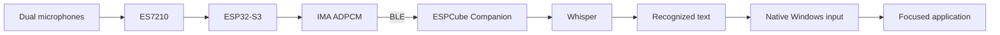
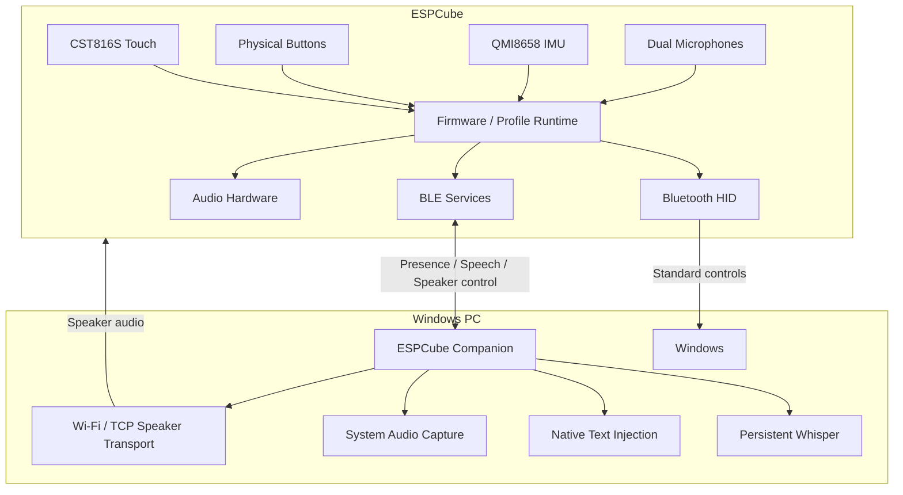
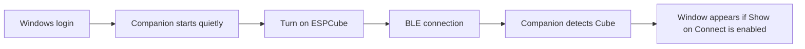
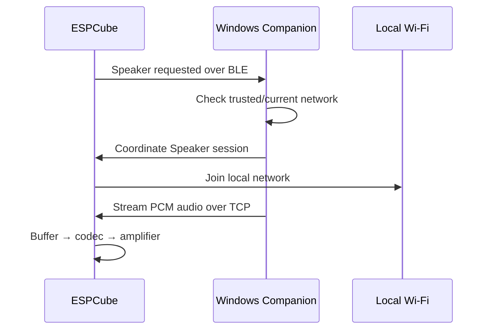

<div align="center">

# ESPCube

### A universal handheld interface built on the ESP32-S3.

**Motion control. Touch. Local speech. Windows audio. One compact device.**

[](https://github.com/hasan-bukhari-dev/ESPCube/releases/latest)


[**Download v1.0.0**](https://github.com/hasan-bukhari-dev/ESPCube/releases/tag/v1.0.0)
&nbsp;•&nbsp;
[**Quick Start**](docs/QUICK_START.md)
&nbsp;•&nbsp;
[**Architecture**](docs/ARCHITECTURE.md)
&nbsp;•&nbsp;
[**Hardware**](docs/HARDWARE.md)
&nbsp;•&nbsp;
[**Troubleshooting**](docs/TROUBLESHOOTING.md)

</div>

---

## What is ESPCube?

**ESPCube is a general-purpose handheld computer interface built around the Waveshare ESP32-S3-Touch-LCD-1.54.**

It combines a 240×240 capacitive touchscreen, a 6-axis IMU, physical buttons, dual microphones, onboard audio hardware, Bluetooth LE, Wi-Fi, 8 MB PSRAM, and 16 MB flash into a profile-driven handheld platform.

The core idea is simple: **one small device should be able to become many useful interfaces without being locked to one game, one app, or one workflow.**

ESPCube v1.0.0 currently provides:

- **Mouse** — gyro-driven pointer control with physical click inputs
- **Text** — touchscreen interaction plus local speech-to-text through the Windows Companion
- **Speaker** — Windows system-audio streaming to the Cube over a temporary Wi-Fi/TCP path
- **Settings** — device and Companion configuration
- **HOME recovery** — hold **A + C** together to return to the launcher

Basic controls are designed around standard Bluetooth HID wherever possible. The native **ESPCube Companion** extends the device with local speech recognition, system-audio capture, Wi-Fi provisioning, background lifecycle management, and status/configuration controls.

> [!IMPORTANT]
> ESPCube is **not dependent on the Companion for ordinary Bluetooth HID operation**.  
> The Companion adds capabilities such as speech recognition and Speaker streaming.

---

## Current release

### ESPCube v1.0.0

**Released:** September 9, 2026  
**Target hardware:** Waveshare ESP32-S3-Touch-LCD-1.54  
**Companion platform:** Windows  
**Firmware:** Arduino framework via PlatformIO  
**Companion:** Native Rust application

### Release downloads

| Asset | Purpose |
|---|---|
| [`ESPCube-Companion-v1.0.0-Setup.exe`](https://github.com/hasan-bukhari-dev/ESPCube/releases/download/v1.0.0/ESPCube-Companion-v1.0.0-Setup.exe) | Windows Companion installer |
| [`firmware.bin`](https://github.com/hasan-bukhari-dev/ESPCube/releases/download/v1.0.0/firmware.bin) | Main firmware image |
| [`firmware.factory.bin`](https://github.com/hasan-bukhari-dev/ESPCube/releases/download/v1.0.0/firmware.factory.bin) | Factory firmware image |
| [`bootloader.bin`](https://github.com/hasan-bukhari-dev/ESPCube/releases/download/v1.0.0/bootloader.bin) | ESP32-S3 bootloader |
| [`partitions.bin`](https://github.com/hasan-bukhari-dev/ESPCube/releases/download/v1.0.0/partitions.bin) | Partition table |
| [`SHA256SUMS.txt`](https://github.com/hasan-bukhari-dev/ESPCube/releases/download/v1.0.0/SHA256SUMS.txt) | Release integrity manifest |

[**View the full v1.0.0 release →**](https://github.com/hasan-bukhari-dev/ESPCube/releases/tag/v1.0.0)

---

# Features

## Mouse

The Mouse profile turns ESPCube into a compact motion controller.

- QMI8658 IMU drives gyro-based pointer movement
- physical buttons provide direct click controls
- touchscreen participates in profile interaction
- standard Bluetooth HID is used for host control
- ordinary mouse functionality does **not** require the Windows Companion

This keeps the most fundamental interface path direct: ESPCube can behave like a normal Bluetooth input device without requiring a custom driver.

---

## Text + local speech

The Text profile combines touchscreen interaction with local voice transcription.

Speech is captured on ESPCube, transported to the Windows Companion over BLE, transcribed locally with Whisper, and inserted into the currently focused Windows application using native input injection.



### Speech design

- transcription runs **locally on the Windows PC**
- release users do **not** need Python
- release users do **not** need `whisper-cli.exe`
- the installer bundles the v1 Whisper model
- the Companion keeps the speech engine available while ESPCube is active

The bundled v1 model is:

```text
companion/models/ggml-tiny.en.bin
```

---

## Speaker

Speaker turns ESPCube into a local Windows audio endpoint.

The Companion captures the active Windows system output, processes the stream, and sends audio to ESPCube over TCP. Bluetooth remains the control/presence path; Wi-Fi is used only for the higher-bandwidth Speaker audio transport.


### Speaker transport

- control/presence: **Bluetooth LE**
- audio transport: **TCP**
- TCP port: **47821**
- PCM: **32 kHz**
- channels: **mono**
- sample format: **signed PCM16 little-endian**

> [!NOTE]
> Normal ESPCube use does not require Wi-Fi.  
> Wi-Fi is activated for the Speaker path because continuous audio needs more bandwidth than the BLE control channel.

---

## Settings

ESPCube and the Companion expose configuration for the device lifecycle and optional services.

Current Companion controls include:

- **Show when ESPCube connects**
- **Start quietly with Windows**
- **Speech typing**
- **Windows Speaker mirror**
- **disconnect grace period**

Device-side settings provide the control surface for hardware/profile behavior such as motion configuration and calibration.

---

## HOME recovery

A universal interface should always have a safe way back.

> **Hold A + C together to return to HOME.**

The HOME gesture is intentionally independent of profile-specific interaction so the user cannot become trapped inside a mode.

---

# Profiles at a glance

| Profile | Primary connection | Companion required? | Purpose |
|---|---|---:|---|
| **Mouse** | Bluetooth HID | No | Gyro pointer and click control |
| **Text** | BLE + host input | For speech | Touch and local speech text entry |
| **Speaker** | BLE + Wi-Fi/TCP | Yes | Windows system-audio streaming |
| **Settings** | Local / BLE as applicable | No for device settings | Device and Companion configuration |

---

# System architecture

ESPCube separates **direct host control** from **extended Companion services**.



### Why two paths?

**Bluetooth HID** handles standard controls directly. That means the Cube can remain useful without a custom desktop application for every interaction.

**BLE services** let the Companion add richer capabilities that standard HID cannot provide cleanly, such as speech-audio transport, device presence, Speaker control, and Wi-Fi session coordination.

---

# Hardware

ESPCube v1 targets the **Waveshare ESP32-S3-Touch-LCD-1.54**.

| Component | Specification |
|---|---|
| MCU | ESP32-S3R8 |
| CPU | Dual-core Xtensa LX7 |
| PSRAM | 8 MB |
| Flash | 16 MB |
| Display | 1.54" 240×240 ST7789 |
| Touch | CST816S capacitive touch |
| IMU | QMI8658 6-axis |
| Microphone frontend | ES7210 |
| Audio codec | ES8311 |
| Amplifier | NS4150B |
| Wireless | 2.4 GHz Wi-Fi + Bluetooth LE |
| Firmware framework | Arduino |
| Build system | PlatformIO |
| Companion | Native Rust / Windows |

<details>
<summary><strong>Developer pinout</strong></summary>

<br>

| Function | GPIO |
|---|---:|
| I²C SDA | 42 |
| I²C SCL | 41 |
| Touch RST | 47 |
| Touch INT | 48 |
| LCD CS | 21 |
| LCD CLK | 38 |
| LCD MOSI | 39 |
| LCD RST | 40 |
| LCD DC | 45 |
| LCD backlight | 46 |
| Audio MCLK | 8 |
| Audio BCLK | 9 |
| Audio WS | 10 |
| Audio DIN | 11 |
| Audio DOUT | 12 |
| Power amplifier control | 7 |

The firmware owns the shared I²C bus with:

```cpp
Wire.begin(42, 41);
```

</details>

---

# Software stack

## Firmware

The firmware is built with the Arduino framework through PlatformIO.

Core technologies:

- ESP32-S3
- Arduino framework
- PlatformIO
- NimBLE-Arduino
- Arduino_GFX
- QMI8658 driver
- ArduinoJson
- custom ESPCube hardware/service modules

High-level organization:

```text
firmware/src/main.cpp
        │
        └── launcher / profile coordination
                 │
                 └── firmware/lib/
                     ├── ESPCubeHID
                     ├── ESPCubeSpeech
                     ├── ESPCubeSpeechLink
                     ├── ESPCubeSpeakerControl
                     ├── ESPCubeSpeakerPlayback
                     ├── ESPCubeSpeakerPcmRingBuffer
                     ├── ESPCubeSpeakerVolume
                     └── ESPCubeSpeakerB1Test
```

v1.0.0 intentionally preserves the runtime architecture that passed device testing rather than performing a risky release-time rewrite.

---

## Windows Companion

The production Companion is a **native Rust application**.

It is responsible for:

- ESPCube discovery and BLE lifecycle
- device presence tracking
- persistent Whisper speech recognition
- speech-audio receive/decode
- native Windows text injection
- Windows system loopback audio capture
- Speaker DSP and TCP transport
- trusted Wi-Fi provisioning
- background startup
- single-instance coordination
- persistent settings
- status and configuration UI
- logging

**Python is not required for normal use.**

---

# How ESPCube connects

Understanding the three connection layers makes the system much easier to reason about.

## 1. Bluetooth HID — direct controls

```text
ESPCube  ── Bluetooth HID ──>  Windows
```

Used for ordinary host input such as mouse/control behavior.

The Companion is not in the middle of this path.

---

## 2. Bluetooth LE — Companion services

```text
ESPCube  <── BLE ──>  ESPCube Companion
```

Used for:

- presence and discovery
- speech control/audio transport
- Speaker control
- Speaker session coordination
- status exchange

Bluetooth remains the primary control and presence transport.

---

## 3. Wi-Fi/TCP — Speaker audio only

```text
Windows Companion  ── local Wi-Fi / TCP ──>  ESPCube
```

Wi-Fi is used only when the Speaker profile needs the higher-bandwidth audio path.

The public firmware does **not** contain personal Wi-Fi credentials. The Companion manages trusted network information locally rather than requiring credentials to be compiled into the firmware.

---

# Install ESPCube

There are two different audiences:

1. **Users** who want to install and use ESPCube
2. **Developers** who want to build it from source

If you only want to use the device, start here.

---

## User installation

### Step 1 — Flash the ESPCube firmware

You need:

- the Waveshare ESP32-S3-Touch-LCD-1.54
- a USB **data** cable
- PlatformIO
- the ESPCube source or release firmware

From the `firmware/` directory:

```powershell
platformio run -e espcube -t upload
```

If your system has multiple serial devices, specify the port:

```powershell
platformio run -e espcube -t upload --upload-port COM22
```

`COM22` is only an example. Your port may be different.

To list Windows serial ports:

```powershell
Get-CimInstance Win32_SerialPort |
    Select-Object DeviceID, Name
```

A Windows flashing helper is also included:

```powershell
.\scripts\flash-windows.ps1 -Port COM22
```

If automatic port detection works on your machine, the explicit port may be omitted.

---

### Step 2 — Install the Windows Companion

Download:

**[`ESPCube-Companion-v1.0.0-Setup.exe`](https://github.com/hasan-bukhari-dev/ESPCube/releases/download/v1.0.0/ESPCube-Companion-v1.0.0-Setup.exe)**

Run the installer normally.

The installer:

- installs per-user
- does not require a Python runtime
- bundles the exact v1 Whisper model
- creates a Start Menu entry
- supports background Windows startup
- includes uninstall support

Default installation location:

```text
%LOCALAPPDATA%\Programs\ESPCube Companion
```

The executable is:

```text
%LOCALAPPDATA%\Programs\ESPCube Companion\ESPCube Companion.exe
```

---

### Step 3 — Pair ESPCube with Windows

If Windows has not paired with the device yet:

```text
Windows Settings
→ Bluetooth & devices
→ Add device
→ Bluetooth
→ ESPCube
```

Make sure Bluetooth is enabled and ESPCube is powered on.

---

### Step 4 — Recommended Companion settings

For normal daily use, enable:

```text
Show when ESPCube connects      ON
Start quietly with Windows      ON
```

This gives the intended lifecycle:



---

# Daily use

Once ESPCube is installed, normal use should require almost no setup.

1. Log into Windows.
2. Turn on ESPCube.
3. Wait for Bluetooth to reconnect.
4. The Companion detects the Cube in the background.
5. If **Show when ESPCube connects** is enabled, the Companion window appears.
6. Select **Mouse**, **Text**, **Speaker**, or **Settings** on the Cube.
7. Hold **A + C** whenever you want to return HOME.

You normally do **not** need to open PowerShell, rebuild firmware, or manually start Whisper.

---

# Companion window and background behavior

The Companion is intended to stay available quietly rather than being repeatedly started and stopped.

## Minimize

Minimizing keeps the window on the Windows taskbar.

## Close button (`X`)

The window close button hides the Companion rather than terminating the background process.

This allows ESPCube services to remain available after the window disappears.

## Automatic display

With:

```text
Show when ESPCube connects
```

enabled, a new ESPCube connection can bring the Companion window back into view.

## Automatic startup

With:

```text
Start quietly with Windows
```

enabled, the Companion starts in the background after Windows login.

---

# Reopening the Companion

## Normal method

Open the Start Menu and search for:

```text
ESPCube Companion
```

You can also launch the installed executable from PowerShell:

```powershell
Start-Process "$env:LOCALAPPDATA\Programs\ESPCube Companion\ESPCube Companion.exe"
```

## Troubleshooting: hidden/stale background instance

If the Companion process is running but the window does not reappear, restart the process:

```powershell
Get-Process "ESPCube Companion" -ErrorAction SilentlyContinue |
    Stop-Process -Force

Start-Process "$env:LOCALAPPDATA\Programs\ESPCube Companion\ESPCube Companion.exe"
```

This is a recovery command, not part of normal daily use.

---

# Wi-Fi and trusted networks

ESPCube does not require Wi-Fi for ordinary Bluetooth HID use.

The **Speaker** profile uses Wi-Fi because continuous audio requires a higher-bandwidth transport.

The Companion manages the trusted Wi-Fi state locally. Personal credentials are not embedded in the public ESPCube firmware source.

A typical Speaker session is:



If you move to a different network, you may need to trust/configure that network in the Companion before Speaker streaming can begin.

---

# Privacy and local processing

ESPCube v1 is designed so that its key enhanced features can operate locally.

### Speech

- Whisper transcription runs locally on the Windows PC.
- The production speech path does not require a cloud transcription service.
- Release users do not need Python or an external Whisper CLI.

### Wi-Fi credentials

- personal credentials are not hardcoded into the public firmware
- trusted network data is managed by the Companion locally
- the repository includes only a safe blank credentials stub

### Network usage

- standard host control uses Bluetooth
- Companion coordination uses BLE
- Speaker audio uses the local Wi-Fi/TCP path

---

# Build from source

## Clone the repository

Because the v1 Whisper model is tracked with Git LFS, install LFS before cloning.

```powershell
git lfs install
git clone https://github.com/hasan-bukhari-dev/ESPCube.git
cd ESPCube
```

Verify that the model is present:

```powershell
git lfs ls-files
```

---

## Build the firmware

Requirements:

- PlatformIO
- USB data connection to the Waveshare ESP32-S3-Touch-LCD-1.54

From the repository root:

```powershell
cd firmware
platformio run -e espcube
```

Flash:

```powershell
platformio run -e espcube -t upload --upload-port COM22
```

Again, replace `COM22` with the actual port on your machine.

---

## Build the Windows Companion

Requirements:

- Windows
- Rust toolchain / Cargo
- the model at `companion/models/ggml-tiny.en.bin`

From `companion/`:

```powershell
cargo check
cargo test
cargo build --release
```

The production source uses `whisper-rs`. `whisper-cli.exe` is not part of the normal runtime path.

### Build the Windows installer

From `companion/`:

```powershell
.\scripts\build-installer-windows.ps1
```

---

# Fresh-source verification

The repository includes a source verification helper:

```powershell
.\scripts\verify-source-build.ps1
```

The v1.0.0 release was validated through the complete release path:

```text
GitHub source
    ↓
fresh clone
    ↓
Git LFS model verification
    ↓
firmware build
    ↓
device flash
    ↓
Companion build + tests
    ↓
installer build
    ↓
installer installation
    ↓
device runtime validation
```

This release process is intended to keep the public repository—not a private development workspace—as the reproducible source of truth.

---

# Release integrity

Every v1.0.0 binary release includes a SHA-256 manifest:

**[`SHA256SUMS.txt`](https://github.com/hasan-bukhari-dev/ESPCube/releases/download/v1.0.0/SHA256SUMS.txt)**

Example Windows verification:

```powershell
Get-FileHash .\ESPCube-Companion-v1.0.0-Setup.exe -Algorithm SHA256
```

Expected v1.0.0 installer SHA-256:

```text
0C94DF4423500F12F5868C3DFD81C09DC9393D8FEA226C069D24B1496D1B4037
```

For all release artifacts, use the published `SHA256SUMS.txt` manifest.

---

# Repository structure

```text
ESPCube/
│
├── firmware/
│   ├── src/                         Main firmware / launcher
│   ├── lib/                         Hardware + service modules
│   ├── include/                     Configuration / safe secrets stub
│   ├── scripts/                     Windows flashing helper
│   └── platformio.ini
│
├── companion/
│   ├── src/                         Native Rust Companion
│   ├── models/                      Whisper model via Git LFS
│   ├── installer/                   Windows installer definition
│   └── scripts/                     Companion/installer build tooling
│
├── docs/
│   ├── ADDING_A_PROFILE.md
│   ├── ARCHITECTURE.md
│   ├── BUILDING.md
│   ├── COMPANION.md
│   ├── HARDWARE.md
│   ├── PROTOCOL.md
│   ├── QUICK_START.md
│   └── TROUBLESHOOTING.md
│
├── releases/
│   └── SHA256SUMS.txt
│
├── scripts/
│   └── verify-source-build.ps1
│
├── .gitattributes
├── .gitignore
└── README.md
```

---

# Low-level protocol summary

<details>
<summary><strong>Speech BLE service</strong></summary>

<br>

Service UUID:

```text
45535043-5542-4c45-8000-000000000001
```

Characteristics:

| Characteristic | UUID suffix |
|---|---|
| CONTROL | `...0002` |
| STATUS | `...0003` |
| AUDIO | `...0004` |

Speech audio uses the v1 IMA ADPCM transport.

</details>

<details>
<summary><strong>Speaker BLE + TCP transport</strong></summary>

<br>

Speaker service UUID:

```text
45535043-5542-4c45-8100-000000000001
```

Characteristics:

| Characteristic | UUID suffix |
|---|---|
| COMMAND | `...0002` |
| STATUS | `...0003` |

Speaker audio transport:

```text
TCP port: 47821
PCM:      32 kHz, mono, signed PCM16 little-endian
```

Bluetooth remains the primary control/presence path.

</details>

For the full protocol reference, see [`docs/PROTOCOL.md`](docs/PROTOCOL.md).

---

# Design principles

ESPCube is developed around a small set of product rules.

### Universal first

The device should not be tied to one game, operating-system feature, or application.

### Standard HID whenever possible

Basic interaction should use host-standard interfaces before introducing custom software dependencies.

### Companion as an extension

The Companion should add capabilities—not become a requirement for basic control.

### HOME must always be recoverable

Profiles should never trap the user. A physical HOME gesture remains available.

### Profiles are capabilities

Mouse, Text, Speaker, Settings, and future modes are different uses of the same hardware platform.

### Local processing where practical

Speech recognition runs locally on the PC, and Speaker transport remains on the local device/network path.

### Preserve proven release behavior

Large architectural refactors should not be introduced simply for elegance immediately before a release.

### Public source is the source of truth

A release should be buildable and testable from a fresh checkout of the public repository.

---

# Adding a profile

ESPCube is intended to grow through additional profiles without sacrificing the universal baseline.

Conceptually:

```text
Launcher
   │
   └── Profile
       ├── touch input
       ├── physical buttons
       ├── IMU
       ├── HID output
       ├── BLE service
       └── optional Companion service
```

v1.0.0 keeps the proven firmware coordinator architecture intact. Future releases can extract cleaner profile boundaries behind stable hardware/service interfaces without changing the fundamental product model.

See:

**[`docs/ADDING_A_PROFILE.md`](docs/ADDING_A_PROFILE.md)**

---

# Troubleshooting

## Companion does not appear

First try the normal installed executable:

```powershell
Start-Process "$env:LOCALAPPDATA\Programs\ESPCube Companion\ESPCube Companion.exe"
```

If it remains hidden, use the restart command documented in [Reopening the Companion](#reopening-the-companion).

---

## Companion cannot find ESPCube

Check:

- Windows Bluetooth is enabled
- ESPCube is powered
- ESPCube is advertising / reconnecting
- the Companion is running

Then restart the Companion if necessary.

---

## Firmware will not upload

Confirm that:

- the USB cable supports data
- the board appears in Device Manager
- you are using the correct COM port

List serial ports:

```powershell
Get-CimInstance Win32_SerialPort |
    Select-Object DeviceID, Name
```

Then flash explicitly:

```powershell
platformio run -e espcube -t upload --upload-port COMxx
```

---

## Speech is unavailable

For release-installer users, the model is bundled automatically.

For source builds, verify:

```text
companion/models/ggml-tiny.en.bin
```

---

## Speaker does not start

Check:

- Windows has an active default audio output
- ESPCube is in the Speaker profile
- the PC is connected to a usable Wi-Fi network
- the current network is trusted/configured in the Companion

If necessary, return HOME and reopen Speaker.

For more cases, see:

**[`docs/TROUBLESHOOTING.md`](docs/TROUBLESHOOTING.md)**

---

# Roadmap

## v1.0.0 — current baseline

- [x] Touchscreen launcher
- [x] Gyro Mouse profile
- [x] Bluetooth HID
- [x] Text profile
- [x] Local Whisper speech recognition
- [x] Native Windows text injection
- [x] Windows Speaker streaming
- [x] Settings
- [x] A + C HOME recovery
- [x] Native Rust Companion
- [x] Windows installer
- [x] Fresh-clone release verification

## Future directions

Potential future work includes:

- additional profiles
- configurable control mappings
- game and media-oriented profiles
- richer desktop integrations
- more Companion personalization
- additional host-platform support
- deeper profile modularization

No roadmap item implies a release date or compatibility commitment.

---

# Documentation

| Document | Purpose |
|---|---|
| [`QUICK_START.md`](docs/QUICK_START.md) | Installation and first-use flow |
| [`HARDWARE.md`](docs/HARDWARE.md) | Hardware components and pinout |
| [`ARCHITECTURE.md`](docs/ARCHITECTURE.md) | Firmware and Companion architecture |
| [`COMPANION.md`](docs/COMPANION.md) | Native Windows Companion responsibilities |
| [`PROTOCOL.md`](docs/PROTOCOL.md) | Speech BLE and Speaker BLE/TCP protocols |
| [`BUILDING.md`](docs/BUILDING.md) | Build firmware and Companion from source |
| [`ADDING_A_PROFILE.md`](docs/ADDING_A_PROFILE.md) | Profile extension contract |
| [`TROUBLESHOOTING.md`](docs/TROUBLESHOOTING.md) | Common failure modes and recovery |

---

# Technology and acknowledgements

ESPCube builds on the work of the wider embedded and open-source ecosystem, including:

- Espressif ESP32-S3
- Waveshare ESP32-S3-Touch-LCD-1.54 hardware
- PlatformIO
- Arduino
- NimBLE-Arduino
- Arduino_GFX
- QMI8658 Arduino support
- Rust
- eframe / egui
- whisper-rs / Whisper ecosystem

Third-party components remain subject to their respective licenses and terms.

---

<div align="center">

## ESPCube v1.0.0

**One handheld. Multiple interfaces. A platform designed to grow.**

[Download](https://github.com/hasan-bukhari-dev/ESPCube/releases/tag/v1.0.0)
&nbsp;•&nbsp;
[Documentation](docs/QUICK_START.md)
&nbsp;•&nbsp;
[Source](https://github.com/hasan-bukhari-dev/ESPCube)

</div>
