# ESPCube Architecture

> Engineering architecture for ESPCube v1.0.0.

[← Back to README](../README.md) · [Protocol](PROTOCOL.md) · [Hardware](HARDWARE.md) · [Companion](COMPANION.md)

---

# System overview

ESPCube is deliberately split into two cooperating runtimes:

1. **Device firmware** on ESP32-S3
2. **Native Windows Companion** in Rust

The boundary is designed so basic host control remains standard while higher-level features use explicit services.

```mermaid
flowchart TB

%% ============================================================
%% ESPCUBE v1.0.0 — MASTER SYSTEM ARCHITECTURE
%% Textbook view: hardware → firmware → transports → Companion
%% → user-visible outputs, lifecycle, and recovery.
%% ============================================================


%% ============================================================
%% 1. ESPCUBE — PHYSICAL HARDWARE
%% ============================================================

subgraph DEVICE["1 · ESPCube — Physical Hardware"]
    direction TB

    subgraph DEVICE_INPUTS["Human + Sensor Inputs"]
        direction LR

        TOUCH["CST816S<br/>Capacitive Touch"]
        BUTTONS["Physical Buttons<br/>A · B · C"]
        IMU["QMI8658<br/>6-axis IMU"]
        MICS["Dual Microphones"]
    end

    subgraph DEVICE_CHIPS["Hardware Interfaces"]
        direction LR

        DISPLAY["ST7789<br/>240 × 240 Display"]
        ES7210["ES7210<br/>Microphone ADC"]
        ESP32["ESP32-S3R8<br/>Firmware Execution"]
        PSRAM[("8 MB PSRAM")]
    end

    MICS -->|"analog microphone signal"| ES7210
    ESP32 --- PSRAM
end


%% ============================================================
%% 2. ESPCUBE — FIRMWARE / PROFILE RUNTIME
%% ============================================================

subgraph FIRMWARE["2 · ESPCube — Firmware / Profile Runtime"]
    direction TB

    subgraph CORE["Core Product Runtime"]
        direction LR

        LAUNCHER["Launcher /<br/>Profile Manager"]
        INPUT["Input Handling"]
        SETTINGS["Settings /<br/>Calibration"]
        HOME["A + C<br/>HOME Recovery"]
        UI["Display /<br/>Profile UI"]
    end

    subgraph PROFILES["Profile Logic"]
        direction LR

        MOUSE["Mouse Profile<br/>Gyro + Buttons"]
        TEXT["Text Profile<br/>Touch + Speech"]
        SPEAKER_PROFILE["Speaker Profile<br/>Session Lifecycle"]
    end

    subgraph DEVICE_SERVICES["Device Services"]
        direction LR

        HID["Bluetooth HID<br/>Service"]

        SPEECH_CAPTURE["Speech Capture<br/>PCM acquisition"]

        ADPCM["IMA ADPCM<br/>Encode + Packetize"]

        SPEECH_GATT["Speech BLE Service<br/>CONTROL · STATUS · AUDIO"]

        SPEAKER_GATT["Speaker BLE Service<br/>COMMAND · STATUS"]

        TCP_RX["Speaker TCP Server<br/>Port 47821"]
    end

    TOUCH --> INPUT
    BUTTONS --> INPUT
    IMU --> INPUT

    INPUT --> LAUNCHER
    INPUT --> MOUSE
    INPUT --> TEXT
    INPUT --> SPEAKER_PROFILE

    BUTTONS --> HOME
    HOME -->|"always recover"| LAUNCHER

    SETTINGS --> LAUNCHER
    LAUNCHER --> UI
    UI --> DISPLAY

    MOUSE --> HID

    TEXT --> SPEECH_CAPTURE
    ES7210 -->|"I²S microphone data"| SPEECH_CAPTURE
    SPEECH_CAPTURE --> ADPCM
    ADPCM --> SPEECH_GATT

    SPEAKER_PROFILE --> SPEAKER_GATT
    SPEAKER_PROFILE --> TCP_RX
end


%% ============================================================
%% 3. DEVICE / HOST TRANSPORT BOUNDARY
%% ============================================================

subgraph TRANSPORT["3 · Device ↔ Host Transport Boundary"]
    direction LR

    HID_LINK["Bluetooth HID<br/>Standard controls"]

    BLE_CONTROL["Bluetooth LE<br/>Presence + Control Plane"]

    BLE_SPEECH["BLE Speech Stream<br/>IMA ADPCM Notifications"]

    WIFI_PROVISION["BLE Wi-Fi Coordination<br/>SSID · Password · Status"]

    TCP_LINK["Local Wi-Fi / TCP<br/>32 kHz Mono PCM16<br/>Port 47821"]
end

HID --> HID_LINK

SPEECH_GATT -->|"START / END + status"| BLE_CONTROL
SPEECH_GATT -->|"compressed speech frames"| BLE_SPEECH

SPEAKER_GATT ---|"Speaker readiness / status"| BLE_CONTROL
SPEAKER_GATT ---|"wifi_set / wifi_connect"| WIFI_PROVISION

TCP_LINK -->|"Speaker PCM stream"| TCP_RX


%% ============================================================
%% 4. WINDOWS HOST + NATIVE COMPANION
%% ============================================================

subgraph WINDOWS_PC["4 · Windows PC"]
    direction TB

    subgraph HOST_OS["Windows Host"]
        direction LR

        WINDOWS["Windows"]
        BT_STACK["Windows Bluetooth Stack"]
        ACTIVE_APP["Focused Windows<br/>Application"]
        AUDIO_ENDPOINT["Default Windows<br/>Audio Output"]
        WLAN["Current Windows<br/>Wi-Fi Network"]
    end


    subgraph COMPANION["ESPCube Companion — Native Rust Application"]
        direction TB

        subgraph COMP_CORE["Companion Core"]
            direction LR

            UI_APP["egui / eframe UI"]
            SETTINGS_PC["Persistent Settings"]
            AUTOSTART["Start Quietly<br/>with Windows"]
            SINGLE["Single Instance<br/>localhost :47823"]
        end

        subgraph BLE_RUNTIME["BLE Runtime"]
            direction LR

            BLE_MANAGER["Unified BLE<br/>Session Manager"]

            PRESENCE["Presence /<br/>Reconnect Manager"]

            SPEECH_COORD["Speech<br/>Coordinator"]

            SPEAKER_COORD["Speaker<br/>Coordinator"]
        end

        subgraph SPEECH_PC["Speech Processing"]
            direction TB

            subgraph SPEECH_ORDER["BLE Ordering Protection"]
                direction LR

                PRESTART["Pre-START<br/>Audio Staging"]
                PENDING_END["Deferred END<br/>800 ms Drain"]
            end

            SESSION["SpeechSession"]

            subgraph SPEECH_CHECKS["Transport Validation"]
                direction LR

                SEQ["Sequence-Gap<br/>Tracking"]
                FRAMES["Frame-Count<br/>Parity"]
                SAMPLES["Sample-Count<br/>Parity"]
                INVALID["Invalid Packet<br/>Accounting"]
                NOTIFY["Firmware Notify<br/>Failure Check"]
            end

            DECODE["IMA ADPCM<br/>Decode"]

            PCM16["16 kHz PCM16<br/>Utterance Buffer"]

            PARITY{"Transport<br/>Clean?"}

            WHISPER["Persistent<br/>WhisperContext"]

            INFERENCE["Local Whisper Inference<br/>English · Greedy · 8 Threads"]

            TRANSCRIPT["Recognized<br/>Transcript"]

            TRAILING["Trailing-Space<br/>Product Contract"]

            SENDINPUT["Win32 Unicode<br/>SendInput"]
        end


        subgraph SPEAKER_PC["Speaker Processing"]
            direction TB

            WIFI_TRUST["Trusted Wi-Fi Handler<br/>Current Windows SSID"]

            WIFI_STATE{"Cube Wi-Fi<br/>State?"}

            WIFI_REUSE["Reuse Existing<br/>CONNECTED IP"]

            WIFI_CONNECT["Connect Previously<br/>CONFIGURED Network"]

            WIFI_SET["Provision Trusted Network<br/>over BLE"]

            WAIT_IP["Wait for Cube<br/>CONNECTED + IP"]

            TCP_CONNECT["TCP Connect<br/>:47821<br/>TCP_NODELAY"]

            LOOPBACK["Windows System<br/>Loopback Capture"]

            AUDIO_QUEUE["Bounded Audio Queue<br/>AudioMessage Blocks"]

            MONO["Convert Captured Audio<br/>to Mono f32"]

            DSP["SpeakerDsp<br/>Resampling / Processing"]

            PCM_PENDING["Pending PCM16<br/>Sample Buffer"]

            CHUNK["320 Samples<br/>640 Bytes · 10 ms"]

            TCP_WRITE["TcpStream<br/>write_all()"]
        end
    end
end


%% ============================================================
%% 5. DIRECT HID PATH
%% ============================================================

HID_LINK -->|"mouse / clicks / standard HID"| BT_STACK
BT_STACK --> WINDOWS


%% ============================================================
%% 6. BLE COMPANION CONNECTION
%% ============================================================

BLE_CONTROL --> BT_STACK
BLE_SPEECH --> BT_STACK
WIFI_PROVISION --- BT_STACK

BT_STACK --> BLE_MANAGER

BLE_MANAGER --> PRESENCE
BLE_MANAGER --> SPEECH_COORD
BLE_MANAGER --> SPEAKER_COORD


%% ============================================================
%% 7. SPEECH DATA PATH
%% ============================================================

BLE_SPEECH -->|"AUDIO notifications"| SPEECH_COORD
BLE_CONTROL -->|"START / END"| SPEECH_COORD

SPEECH_COORD --> PRESTART
SPEECH_COORD --> PENDING_END

PRESTART --> SESSION
PENDING_END --> SESSION

SESSION --> SEQ
SESSION --> FRAMES
SESSION --> SAMPLES
SESSION --> INVALID
SESSION --> NOTIFY

SESSION --> DECODE
DECODE --> PCM16

SEQ --> PARITY
FRAMES --> PARITY
SAMPLES --> PARITY
INVALID --> PARITY
NOTIFY --> PARITY
PCM16 --> PARITY

PARITY -->|"yes"| WHISPER
PARITY -->|"no · reject utterance"| SPEECH_COORD

WHISPER --> INFERENCE
PCM16 --> INFERENCE

INFERENCE --> TRANSCRIPT
TRANSCRIPT --> TRAILING
TRAILING --> SENDINPUT
SENDINPUT -->|"native Unicode keyboard events"| ACTIVE_APP


%% ============================================================
%% 8. SPEAKER CONTROL PLANE
%% ============================================================

SPEAKER_COORD -->|"Speaker GATT state = READY"| WIFI_TRUST

WLAN -->|"current SSID"| WIFI_TRUST

WIFI_TRUST --> WIFI_STATE

WIFI_STATE -->|"CONNECTED"| WIFI_REUSE
WIFI_STATE -->|"CONFIGURED"| WIFI_CONNECT
WIFI_STATE -->|"not configured"| WIFI_SET

WIFI_SET ---|"wifi_set via BLE"| WIFI_PROVISION
WIFI_CONNECT ---|"wifi_connect via BLE"| WIFI_PROVISION

WIFI_REUSE --> WAIT_IP
WIFI_CONNECT --> WAIT_IP
WIFI_SET --> WAIT_IP

WAIT_IP --> TCP_CONNECT


%% ============================================================
%% 9. SPEAKER AUDIO DATA PLANE
%% ============================================================

AUDIO_ENDPOINT -->|"system output"| LOOPBACK

LOOPBACK --> AUDIO_QUEUE
AUDIO_QUEUE --> MONO
MONO --> DSP

DSP -->|"32 kHz output"| PCM_PENDING

PCM_PENDING -->|"when ≥ 320 samples"| CHUNK
CHUNK --> TCP_WRITE

TCP_CONNECT --> TCP_WRITE

TCP_WRITE -->|"640-byte PCM16 chunks"| TCP_LINK


%% ============================================================
%% 10. ESPCUBE SPEAKER PLAYBACK
%% ============================================================

subgraph DEVICE_PLAYBACK["5 · ESPCube — Speaker Playback Path"]
    direction TB

    RING[("PSRAM PCM Ring Buffer<br/>128 KiB")]

    PREBUFFER["Playback Prebuffer<br/>12 × 10 ms = 120 ms"]

    BUFFER_STATE["Ring State<br/>head · tail · occupancy<br/>high-water mark"]

    PLAYBACK["PCM Playback Engine"]

    I2S["I²S Output<br/>32 kHz Mono PCM16"]

    ES8311["ES8311<br/>Audio Codec"]

    VOLUME["Digital / Codec<br/>Volume Control"]

    AMP["NS4150B<br/>Power Amplifier"]

    PHYSICAL_SPK["Physical Speaker"]

    TCP_RX -->|"incoming PCM bytes"| RING

    RING --> BUFFER_STATE
    RING --> PREBUFFER

    PREBUFFER -->|"enough buffered audio"| PLAYBACK
    RING --> PLAYBACK

    PLAYBACK --> I2S
    I2S --> ES8311
    ES8311 --> VOLUME
    VOLUME --> AMP
    AMP --> PHYSICAL_SPK
end


%% ============================================================
%% 11. COMPANION PRESENCE LIFECYCLE
%% ============================================================

subgraph LIFECYCLE["6 · Companion Presence Lifecycle"]
    direction LR

    DORMANT["Dormant<br/>Cube absent<br/>Whisper unloaded"]

    ACTIVATING["Activating<br/>Device setup"]

    READY["Ready<br/>BLE services available<br/>Whisper kept loaded"]

    GRACE["Grace<br/>Reconnect scanning<br/>Whisper stays warm"]

    DORMANT -->|"ESPCube discovered"| ACTIVATING
    ACTIVATING -->|"services resolved"| READY
    READY -->|"BLE disconnect"| GRACE
    GRACE -->|"reconnect before deadline"| READY
    GRACE -->|"grace expires"| DORMANT
end

PRESENCE -.->|"updates"| DORMANT
PRESENCE -.-> ACTIVATING
PRESENCE -.-> READY
PRESENCE -.-> GRACE


%% ============================================================
%% 12. DESKTOP / UI LIFECYCLE
%% ============================================================

subgraph DESKTOP_LIFE["7 · Companion Desktop Behavior"]
    direction LR

    LOGIN["Windows Login"]
    BG["Background Start<br/>--background"]
    HIDDEN["Window Hidden<br/>Process Still Running"]
    SHOW["Show on Connect<br/>Visible + Focus"]
    CLOSE["X Button<br/>Hide, Do Not Quit"]

    LOGIN --> AUTOSTART
    AUTOSTART --> BG
    BG --> HIDDEN

    READY -.->|"new connection generation"| SHOW
    SHOW --> UI_APP

    UI_APP --> CLOSE
    CLOSE --> HIDDEN

    SINGLE -.->|"SHOW request"| SHOW
end


%% ============================================================
%% 13. SPEAKER RECOVERY PATHS
%% ============================================================

subgraph RECOVERY["8 · Speaker Failure Recovery"]
    direction TB

    STREAMING["Normal Speaker Streaming"]

    FAILURE{"What changed?"}

    ENDPOINT_FAIL["Windows Audio<br/>Endpoint Changed"]

    TCP_FAIL["TCP Write Failed"]

    DROP_CAPTURE["Drop Old Capture<br/>Drain Queue"]

    RESTART_CAPTURE["Restart Loopback<br/>on New Default Endpoint"]

    REBUILD_DSP["Rebuild DSP<br/>for New Sample Rate"]

    CHECK_READY{"Speaker GATT<br/>Still READY?"}

    CHECK_WIFI{"Cube Wi-Fi<br/>Still CONNECTED?"}

    REUSE_IP["Reuse Current IP"]

    REPROVISION["BLE Re-provision /<br/>Reconnect Wi-Fi"]

    RETRY_TCP["Reconnect TCP :47821"]

    CLEAR_STALE["Clear Pending PCM<br/>Drain Old Audio Queue"]

    RESUME["Resume Streaming"]

    STREAMING --> FAILURE

    FAILURE -->|"audio endpoint"| ENDPOINT_FAIL
    FAILURE -->|"TCP write"| TCP_FAIL

    ENDPOINT_FAIL --> DROP_CAPTURE
    DROP_CAPTURE --> RESTART_CAPTURE
    RESTART_CAPTURE --> REBUILD_DSP
    REBUILD_DSP --> RESUME

    TCP_FAIL --> CHECK_READY

    CHECK_READY -->|"no"| STOP_STREAM["Stop Speaker Worker"]
    CHECK_READY -->|"yes"| CHECK_WIFI

    CHECK_WIFI -->|"yes"| REUSE_IP
    CHECK_WIFI -->|"no"| REPROVISION

    REUSE_IP --> RETRY_TCP
    REPROVISION --> RETRY_TCP

    RETRY_TCP --> CLEAR_STALE
    CLEAR_STALE --> REBUILD_DSP
end

LOOPBACK -.->|"endpoint error"| ENDPOINT_FAIL
TCP_WRITE -.->|"write failure"| TCP_FAIL


%% ============================================================
%% 14. PRODUCT SAFETY / PROFILE OWNERSHIP
%% ============================================================

subgraph SAFETY["9 · Product Safety + Resource Ownership"]
    direction LR

    PROFILE_EXIT["Profile Exit"]

    RELEASE_HID["Release Held<br/>HID State"]

    STOP_TEMP["Stop Temporary<br/>Audio / Network State"]

    RETURN_HOME["Return to<br/>Launcher"]

    WIFI_DEFAULT["Wi-Fi Off by Default<br/>except Speaker"]

    PROFILE_EXIT --> RELEASE_HID
    PROFILE_EXIT --> STOP_TEMP
    PROFILE_EXIT --> RETURN_HOME

    HOME --> RETURN_HOME

    SPEAKER_PROFILE -.-> WIFI_DEFAULT
end
```



---

# Architectural boundary

## Direct path

```text
ESPCube ── Bluetooth HID ──► Windows
```

Used whenever standard HID is sufficient.

This path does not need the Companion.

## Extended path

```text
ESPCube ◄──── BLE ────► Companion
```

Used for:

- presence
- speech transport
- Speaker control
- status
- Wi-Fi provisioning

## High-bandwidth Speaker path

```text
Companion ── TCP / local Wi-Fi ──► ESPCube
```

Used only for PCM audio.

The control plane stays on BLE while the high-bandwidth data plane moves to TCP.

---

# Firmware architecture

The current v1 firmware keeps the proven profile coordinator in:

```text
firmware/src/main.cpp
```

Reusable services live in focused libraries:

```text
firmware/lib/
├── ESPCubeHID
├── ESPCubeSpeech
├── ESPCubeSpeechLink
├── ESPCubeSpeakerControl
├── ESPCubeSpeakerPlayback
├── ESPCubeSpeakerPcmRingBuffer
├── ESPCubeSpeakerVolume
└── ESPCubeSpeakerB1Test
```

v1 intentionally does not perform a large profile-class rewrite immediately before release. Stable runtime behavior is prioritized over cosmetic abstraction.

---

# Companion architecture

The Companion is one native Rust process with responsibilities split across modules.

Conceptually:

```text
main
 │
 ├── app / UI
 ├── settings
 ├── single-instance control
 ├── BLE supervisor
 │    ├── presence lifecycle
 │    ├── speech service
 │    └── Speaker service
 ├── speech
 │    ├── ADPCM decode
 │    ├── parity / sequence validation
 │    ├── Whisper
 │    └── SendInput
 ├── audio
 │    └── Windows loopback
 ├── dsp
 ├── speaker
 │    ├── Wi-Fi provisioning
 │    ├── TCP transport
 │    └── endpoint recovery
 ├── wifi
 └── logging
```

---

# BLE presence lifecycle

The Companion tracks four presence states:

```text
Dormant
   │
   ▼
Activating
   │
   ▼
 Ready
   │
   │ BLE disconnect
   ▼
 Grace
   │
   ├── device returns ─────────► Ready
   │
   └── deadline expires ───────► Dormant
```

## Dormant

- Companion watches quietly
- heavy speech runtime is not retained
- Speaker is idle

## Activating

- device is being prepared
- runtime is considered awake

## Ready

- ESPCube is connected over BLE
- required services are available
- connection generation increments on a new Ready transition
- optional show-on-connect behavior can surface the window

## Grace

- a disconnect has occurred
- reconnect scanning continues
- Whisper can remain loaded
- the grace deadline is configurable
- the default is 180 seconds

When Grace expires, Whisper is dropped and the runtime returns to Dormant.

### Why Grace exists

Without Grace, a brief BLE interruption would unnecessarily:

- unload Whisper
- discard warm runtime state
- force full rediscovery/reinitialization immediately

Grace turns short disconnects into a recoverable lifecycle event rather than a full cold restart.

---

# Speech architecture

The speech path is more than “send microphone audio to Whisper.”

```text
Microphones
   │
   ▼
ES7210
   │
   ▼
ESP32-S3
   │
   ├── IMA ADPCM
   ├── packet sequence
   └── sample/frame totals
   │
   ▼
BLE AUDIO notifications
   │
   ▼
Companion SpeechSession
   │
   ├── packet format validation
   ├── sequence-gap accounting
   ├── ADPCM decode
   ├── decoded PCM accumulation
   ├── expected sample count
   └── expected frame count
   │
   ▼
transport parity validation
   │
   ▼
Whisper
   │
   ▼
Unicode SendInput
```

## Packet integrity

The Companion tracks:

- expected sequence number
- sequence gaps
- audio packet count
- invalid packet count
- decoded PCM sample count

At `END`, firmware-provided metadata is checked against the Companion's observed transport.

A speech session is only considered transport-clean when:

- sample totals match
- frame totals match
- firmware reports zero notification failures
- no sequence gaps were observed
- no invalid packets were observed
- decoded PCM is non-empty

## Notification ordering protection

Windows BLE notification ordering can produce edge cases around speech boundaries.

v1 handles two important cases:

### AUDIO before START

A small pre-START staging queue can retain the beginning of a sequence that starts at frame 0.

### END before final AUDIO

`END` is deferred rather than finalized immediately. The Companion waits for the expected frame/sample counts or an 800 ms deadline before finalizing.

This makes the transport tolerant of control/audio notification ordering without silently accepting corrupted parity.

---

# Persistent Whisper architecture

The model is loaded once into a `WhisperEngine` context while speech is enabled and the device runtime is active.

Each utterance creates an inference state from the persistent context rather than launching a separate process.

Current inference configuration includes:

- English
- greedy decoding
- 8 threads
- no timestamps
- no translation
- no prior context

The practical effect is that the expensive model load is not repeated per utterance.

---

# Native text injection

After transcription, the Companion appends the product's trailing-space contract and injects the text using native Windows `SendInput`.

For each UTF-16 unit:

```text
Unicode key down
      │
      ▼
Unicode key up
```

This avoids depending on clipboard paste or an external automation tool.

---

# Speaker architecture

Speaker uses BLE as the control plane and TCP as the PCM data plane.

```text
BLE status says Speaker READY
      │
      ▼
Load trusted current Windows Wi-Fi
      │
      ├── reuse already-connected Cube Wi-Fi if possible
      ├── connect configured Wi-Fi if available
      └── otherwise provision SSID/password over BLE
      │
      ▼
Connect TCP :47821
      │
      ▼
Start Windows system loopback
      │
      ▼
DSP / resampling
      │
      ▼
320-sample PCM16 chunks
      │
      ▼
TCP
      │
      ▼
Device PCM ring buffer
      │
      ▼
I²S playback path
```

---

# Device-side PCM ring buffer

The v1 ring buffer is a purpose-built byte ring backed by ESP32-S3 PSRAM.

Allocation requests:

```text
MALLOC_CAP_SPIRAM | MALLOC_CAP_8BIT
```

The structure tracks:

- head
- tail
- current size
- capacity
- high-water mark

`push()` clamps writes to free capacity.  
`pop()` clamps reads to available data.  
Both wrap around the buffer boundary.

The ring decouples network arrival timing from audio playback timing.

That separation is essential for a streamed-audio path: TCP delivery and I²S consumption do not run with identical timing.

---

# Speaker recovery behavior

The Companion monitors Speaker readiness while streaming.

## Windows endpoint change

If loopback capture reports an endpoint change:

1. Speaker status becomes Recovering.
2. old capture is dropped
3. queued capture messages are drained
4. capture is retried
5. DSP is rebuilt for the new input sample rate
6. streaming resumes

## TCP write failure

If a TCP write fails while the device is still Ready:

1. current Speaker status is re-read over BLE
2. existing Wi-Fi is reused if still connected
3. otherwise Wi-Fi can be re-provisioned/reconnected
4. TCP is re-established
5. pending PCM is cleared
6. queued old audio is drained
7. DSP state is rebuilt

This keeps recovery scoped to the broken layer.

---

# Why BLE + TCP instead of one transport?

BLE is a strong fit for:

- discovery
- presence
- low-volume control
- GATT status
- speech payloads at the v1 compressed rate

Continuous Speaker PCM is a different workload.

v1 therefore uses:

```text
BLE = identity + control plane
TCP = high-bandwidth Speaker data plane
```

This keeps each transport responsible for the job it handles well.

---

# Trusted Wi-Fi boundary

Trusted network state is owned by the Windows Companion.

```text
%LOCALAPPDATA%\ESPCube\trusted_wifi.json
```

The public firmware contains blank credential constants and does not ship a personal network password.

During Speaker activation, the Companion can send the current trusted network to the device over the Speaker BLE command characteristic.

---

# Desktop lifecycle

The Companion is intentionally not a one-shot console process.

It supports:

- startup with Windows
- background launch
- hidden window state
- show-on-connect
- persistent JSON settings
- single-instance coordination over localhost
- device presence tracking
- graceful runtime sleep

The single-instance control address is:

```text
127.0.0.1:47823
```

A second launch can send a `SHOW` request to the primary instance.

---

# Failure boundaries

ESPCube v1 tries to fail locally:

| Failure | Intended scope |
|---|---|
| HID issue | input path |
| BLE disconnect | enter Grace / reconnect |
| speech parity mismatch | reject that utterance |
| Whisper error | speech service only |
| Windows input failure | text insertion only |
| audio endpoint change | restart loopback/DSP |
| TCP write failure | reconnect Speaker data path |
| Wi-Fi unavailable | Speaker only |
| Companion hidden | UI lifecycle only |

The device's universal baseline should not disappear merely because an optional service fails.

---

# Architectural invariants

Future changes should preserve:

1. HOME remains physically recoverable.
2. Basic HID does not depend on the Companion.
3. Wi-Fi is not required for ordinary controls.
4. Personal credentials do not live in public firmware.
5. profile teardown releases temporary resources.
6. release changes are proven on the actual device.
7. stable behavior is not sacrificed for a release-time refactor.

See [`DESIGN_PRINCIPLES.md`](DESIGN_PRINCIPLES.md).

---

## Related docs

- [Protocol](PROTOCOL.md)
- [Companion](COMPANION.md)
- [Hardware](HARDWARE.md)
- [Adding a Profile](ADDING_A_PROFILE.md)
